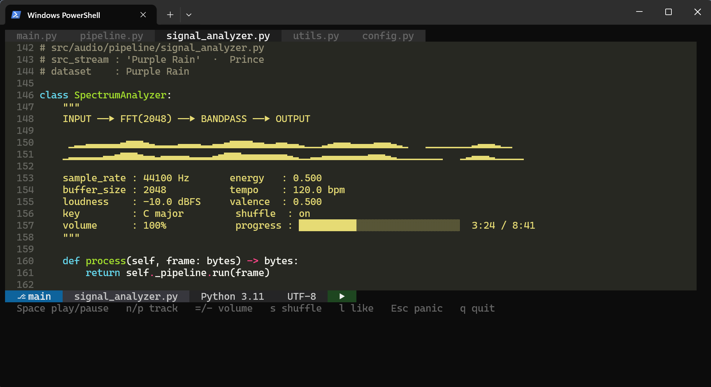
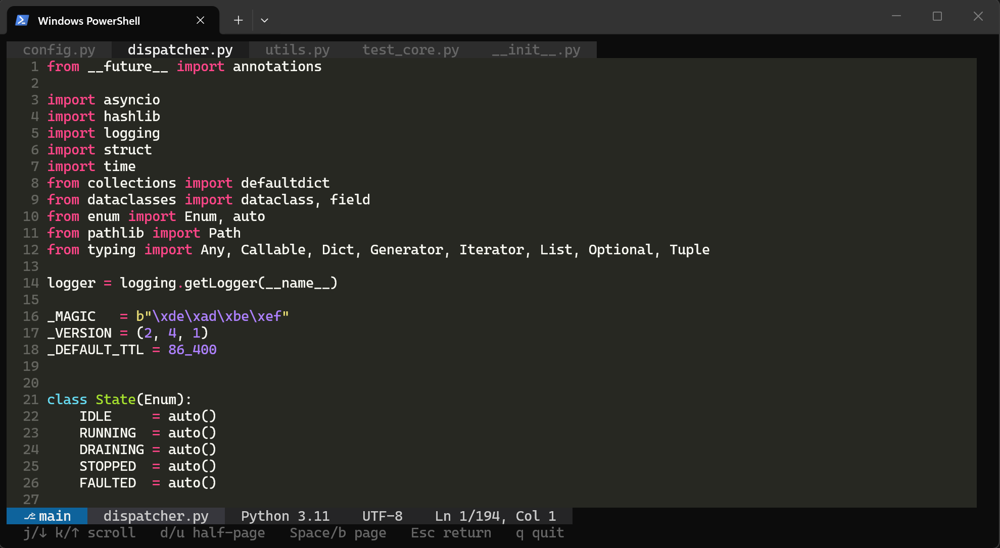

# sfw_terminal_music_player
Spotify player in the terminal, disguised as a real-time signal analysis tool. Waveform animates from audio features, track info hidden as source-code comments.

## Screenshots

### Playing view
<!-- Add screenshot: python player.py with SPOTIFY_MOCK=1 -->


### Panic mode
<!-- Add screenshot: press Esc while playing -->


## Setup

```
pip install -r requirements.txt
cp .env.example .env
# fill in SPOTIFY_CLIENT_ID and SPOTIFY_CLIENT_SECRET in .env
```

See `HANDOVER.md` for full Spotify credential setup instructions.

## Usage

```bash
# Real Spotify (requires .env with credentials)
python player.py

# Mock data — no credentials needed, for UI testing
set SPOTIFY_MOCK=1 && python player.py   # Windows
SPOTIFY_MOCK=1 python player.py          # Mac/Linux
```

## Keys

| Key | Action |
|-----|--------|
| `Space` | Play / pause |
| `n` / `p` | Next / previous track |
| `=` / `-` | Volume up / down |
| `s` | Toggle shuffle |
| `l` | Like / unlike current track |
| `Esc` | Toggle panic mode |
| `q` | Quit |
